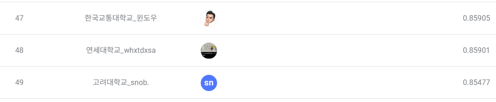

# DACON: Rearrange Image

# Overview

---

> **퍼즐 이미지를** 재구성하는 AI 모델을 개발해야 합니다. 구체적으로는 4x4의 격자 형태의 16개의 조각으로 구성된 순서가 뒤바뀐 퍼즐 이미지를 대상으로 원래 순서를 맞추는 것입니다.
> 

[대학 대항전 : 퍼즐 이미지 AI 경진대회](https://dacon.io/competitions/official/236207/overview/description)

### Purpose of the Participation

Practice design whole process of the project using object oriented programming. Complete the work and publish it on the GitHub.

### Structure of Directory

- **root**
    - **data** (the folder of dataset)
        
        
    - **model** (the folder of model parameters)
        
        
    - **module** (the folder of module used by main.py)
        
        data_download
        
        data_loader
        
        custom_dataset.py
        
        custom_model.py
        
        model_eval
        
        model_train
        
    
    config.yaml
    
    main_eval.py
    
    main.py
    
    requirements.txt
    


# Data Prepare

---

### Download Data

Project was proceeded on the Cloud environment, VESSL. Due to the CLI environment, download dataset in the google drive using ‘gdown’ method.

- def download_and_unzip
    
    ```python
    def download_and_unzip():
        if not os.path.exists('open.zip'):
            # Download data from Google Drive
            subprocess.run(['pip', 'install', 'gdown'], check=True)
            subprocess.run(['gdown', 'https://drive.google.com/uc?id=13oGkm3Ao7fL2p51H62J68Gw630ABBR0g'], check=True)
    
        if not os.path.exists('./data/train'):
            # Unzip to the 'data' directory
            subprocess.run(['unzip', 'open.zip', '-d', 'data'], check=True)
    ```
    

### Define Custom Dataset

We have to send two information to model. One is csv file. the other is image file. So we will combine these information together by the custom dataset which is called ‘JigsawDataset’.

- class JigsawDataset
    
    ```python
    class JigsawDataset(Dataset):
        def __init__(self, df, data_path, mode='train', transform=None):
            self.df = df
            self.data_path = data_path
            self.mode = mode
            self.transform = transform
    
        def __len__(self):
            return len(self.df)
    
        def __getitem__(self, idx):
            if self.mode == 'train':
                row = self.df.iloc[idx]
                image = read_image(os.path.join(self.data_path, row['img_path']))
                shuffle_order = row[[str(i) for i in range(1, 17)]].values-1
                image = self.reset_image(image, shuffle_order)
                image = Image.fromarray(image)
                if self.transform:
                    image = self.transform(image)
                return image
            elif self.mode == 'test':
                row = self.df.iloc[idx]
                image = Image.open(os.path.join(self.data_path, row['img_path']))
                if self.transform:
                    image = self.transform(image)
                return image
    ```
    

### Construct Dataset

After define custom data class, we will use that class with transform function. Combine two type of dataset.

- def build_transform
    
    ```python
    def build_transform(is_train):
        resize_transform = transforms.Resize((384, 384), interpolation=transforms.InterpolationMode.BICUBIC)
        normalize_transform = transforms.Normalize(IMAGENET_DEFAULT_MEAN, IMAGENET_DEFAULT_STD)
    
        if is_train:
            # Apply milder augmentation for training
            train_transform = transforms.Compose([
                resize_transform,
                transforms.ColorJitter(brightness=0.1, contrast=0.1, saturation=0.1, hue=0.1),
                transforms.RandomAffine(degrees=5, translate=(0.05, 0.05), scale=(0.95, 1.05)),
                transforms.ToTensor(),
                normalize_transform
            ])
            return train_transform
    
        # For validation, apply only resizing and normalization
        valid_transform = transforms.Compose([
            resize_transform,
            transforms.ToTensor(),
            normalize_transform
        ])
        return valid_transform
    ```
    
- def get_dataset
    
    ```python
    def get_dataset(df, data_path='./data', is_train=True):
        if is_train:
            mode = "train"
        else:
            mode = "test"
        
        dataset = JigsawDataset(df = df,
                                data_path=data_path,
                                mode = mode,
                                transform = build_transform(is_train)
        )
        return dataset
    ```
    

# Model(DeiT3)

---

### Vision Transformer

DeiT3 is the model from the ViT(Vision Transformer). It distill ViT so that It can do better job even though it’s magnitude is smaller. 

DeiT3 works same as ViT and ViT is motivated from Transformer. 

1. It use Image Patch, not text token as Transformer. 
2. Add positional information to the Image Patch.
3. Learned by encoder layer which include Multi-Head Attention.

There are two key elements in the model structure which are transfer learning and masking.

### Transfer Learning

Using pretrained model is the best way to reduce time and increase the model ability. We will use the 'deit3_base_patch16_384’ model as based model. 

To adjust the output layer, we should customize fully connected layer and add it after deit3. 

- def __init__
    
    ```python
    def __init__(self, mask_ratio = 0.0, pretrained = True, fc_layer = 3):
            deit3 = timm.create_model('deit3_base_patch16_384', pretrained = pretrained)
    
            if fc_layer == 3:
                self.jigsaw = nn.Sequential(
                    nn.Linear(768, 768),
                    nn.ReLU(),
                    nn.Linear(768, 768),
                    nn.ReLU(),
                    nn.Linear(768, 24 * 24)
                )
    ```
    

### Masking

Masking is the main mechanism to increase the model ability. The purpose of the model is to get original order of puzzles. Masking can do below roles:

- Reinforce to understand the image context.
    
    To restore masked regions or align the sequence, the model needs to understand the context of the surrounding patches or the entire image. This helps the model grasp a broader range of contextual features.
    
- Reinforce to solve the puzzle.
    
    In tasks like solving a 4x4 puzzle, predicting the original positions of masked patches is an effective way to train the model to learn spatial relationships and pattern recognition. Masking plays a crucial role in helping the model understand how each patch should be positioned within the entire image.
    
- def random_masking
    
    ```python
    def random_masking(self, x, mask_ratio):
            N, L, D = x.shape  # batch, length, dim
            len_keep = int(L * (1 - mask_ratio)) # The length which not be masked
    
            noise = torch.rand(N, L, device=x.device)  # noise in [0, 1]
    
            # sort noise for each sample
            ids_shuffle = torch.argsort(noise, dim=1)  # ascend: small is keep, large is remove
    
            # keep the first subset
            ids_keep = ids_shuffle[:, :len_keep] # N, len_keep
            x_masked = torch.gather(x, dim=1, index=ids_keep.unsqueeze(-1).repeat(1, 1, D))
            target_masked = ids_keep
            return x_masked, target_masked
    ```
    

### Entire Code of Model

```python
class Model(nn.Module):
    def __init__(self, mask_ratio = 0.0, pretrained = True, fc_layer = 3):
        super().__init__()

        self.mask_ratio = mask_ratio
        self.pretrained = pretrained

        deit3 = timm.create_model('deit3_base_patch16_384', pretrained = pretrained)

        # Use relevant parts of DEiT3
        self.patch_embed = deit3.patch_embed
        self.cls_token = deit3.cls_token
        self.blocks = deit3.blocks
        self.norm = deit3.norm

        if fc_layer == 1:
            self.jigsaw = nn.Linear(768, 24*24)
        elif fc_layer == 2:
            self.jigsaw = nn.Sequential(
                nn.Linear(768, 768),
                nn.ReLU(),
                nn.Linear(768, 24 * 24)
            )
        else:
            self.jigsaw = nn.Sequential(
                nn.Linear(768, 768),
                nn.ReLU(),
                nn.Linear(768, 768),
                nn.ReLU(),
                nn.Linear(768, 24 * 24)
            )

    def random_masking(self, x, mask_ratio):
        N, L, D = x.shape  # batch, length, dim
        len_keep = int(L * (1 - mask_ratio)) # The length which not be masked

        noise = torch.rand(N, L, device=x.device)  # noise in [0, 1]

        # sort noise for each sample
        ids_shuffle = torch.argsort(noise, dim=1)  # ascend: small is keep, large is remove

        # keep the first subset
        ids_keep = ids_shuffle[:, :len_keep] # N, len_keep
        x_masked = torch.gather(x, dim=1, index=ids_keep.unsqueeze(-1).repeat(1, 1, D))
        target_masked = ids_keep
        return x_masked, target_masked

    def forward(self, x):
        x = self.patch_embed(x)
        x, target = self.random_masking(x, self.mask_ratio)

        # append cls token
        cls_tokens = self.cls_token.expand(x.shape[0], -1, -1)
        x = torch.cat((cls_tokens, x), dim=1)

        # apply Transformer blocks
        x = self.blocks(x)
        x = self.norm(x)
        x = self.jigsaw(x[:, 1:])
        return x.reshape(-1, 24*24), target.reshape(-1)

    def forward_test(self, x):
        x = self.patch_embed(x)

        # append cls token
        cls_tokens = self.cls_token.expand(x.shape[0], -1, -1)
        x = torch.cat((cls_tokens, x), dim=1)

        # apply Transformer blocks
        x = self.blocks(x)
        x = self.norm(x)
        x = self.jigsaw(x[:, 1:])
        return x
```

# Training

---

There are two options that we adjusted. The first one is fully connected layer. The other one is hyperparameter.

We use ‘config’ file to manage that options easily.

### Fully Connected Layer

We use three kinds of fc_layer. To increase the number of layer makes model complicate. It can lead overfitting.

```python
		 if fc_layer == 1:
            self.jigsaw = nn.Linear(768, 24*24)
     elif fc_layer == 2:
            self.jigsaw = nn.Sequential(
                nn.Linear(768, 768),
                nn.ReLU(),
                nn.Linear(768, 24 * 24)
            )
        else:
            self.jigsaw = nn.Sequential(
                nn.Linear(768, 768),
                nn.ReLU(),
                nn.Linear(768, 768),
                nn.ReLU(),
                nn.Linear(768, 24 * 24)
            )
```

For the first time, we start to train model setting fc_layer one and three. We proceed it untill about 40 epochs. There is no significant difference and it takes much training time. So that we just use model with three fc_layer.

### Hyperparameter

Since there are a lot of hyperparameters, we just introduce a few elements.

- Mask Ratio
    
    Mask ratio has a great role in this project. Masking not only reduce the time for training but also reiforce reasoning ability of the ****model. 
    
    However in reality, the model encounter the pieces of image that are not masked. So that we trained the model by gradually ****reducing the mask ratio.
    
    | Start masking ratio | 12 < epoch | 24 < epoch | 40 < epoch | 60 < epoch |
    | --- | --- | --- | --- | --- |
    | 0.25 | 0.1 | 0.02 | 0.005 | 0 |
- Learning Rate
    
    Large learning rate will lead model convergent fast. However if it is large enough to skip extreme value or be overfited, we have to small it. We changed learning rate when model is overfitted.
    
    | Start learning rate | When 0.001, overfitted | When 0.0005, overfitted | When 0.0001, overfitted |
    | --- | --- | --- | --- |
    | 0.001 | 0.0005 | 0.0001 | 0.00005 |
- Epochs
    
    Just increased epochs where model is underfitted and saved model’s weight. After config overfitting, we changed hyperparameters and proceeded from saved model’s weight.
    <p align="left">
           
    </p>
    

### Entire Code of Config

```yaml
is_import_model: True
import_model_name: '/model_state_24.pth'

model_save_path: './model/model_layer'
result_save_path: './result/model_layer'
data_path: './data'

num_fc_layer: 3
mask_ratio: 0
pretrained: True

lr: 0.00005
weight_decay: 0.05
epochs: 20

train_size: -1
test_size: -1
batch_size: 16
num_workers: 16
```

# Result

---

| Day | 01/29 | 02/01 | 02/02 | 02/03 | 02/04 | 02/05 |
| --- | --- | --- | --- | --- | --- | --- |
| Max accuracy | 0.02 | 0.54 | 0.61 | 0.73 | 0.84 | 0.85 |

<p align="center">
       
</p>

# Future work

---

- Restore puzzles by the result csv file. Analize the puzzles which are mismatched and changed the algorithm of the model.
- In the case of result that there exist the redundant order, deal with the order to remove redundant order.
- Try to use another model.

# Reference

---

- Deit model
    
    [[DeiT 관련 논문 리뷰] 03-AN IMAGE IS WORTH 16X16 WORDS: TRANSFORMERS FOR IMAGE RECOGNITION AT SCALE](https://velog.io/@heomollang/DeiT-관련-논문-리뷰-03-AN-IMAGE-IS-WORTH-16X16-WORDSTRANSFORMERS-FOR-IMAGE-RECOGNITION-AT-SCALEViT)
    
    [Jigsaw-ViT 모델](https://dacon.io/competitions/official/236207/codeshare/9572?page=1&dtype=recent)
    
- Solving puzzle without DL
    
    [딥러닝 없이 퍼즐 풀어보기](https://dacon.io/competitions/official/236207/codeshare/9603?page=1&dtype=recent)